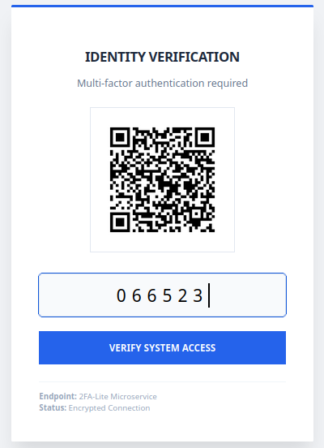

# 2FA-Lite
A stateless, high-performance TOTP microservice. Built with Python and Alpine Linux for a **minimal footprint and memory-only QR generation** that you can implement for two factor authentication in your project fast and easy.

[](https://github.com/leokasion/2FA-Lite/actions)



## Overview

2FA-Lite is designed for high-security environments where a minimal footprint is required. It functions as a "headless" API, generating QR codes in RAM and verifying tokens without ever writing to the disk.

### Key Features
- **Stateless:** No database required. All logic is handled via secret keys.
- **Security-First:** QR codes are generated in-memory and streamed directly to the client.
- **Lite Footprint:** Built on Alpine Linux with a hard 128MB RAM limit.
- **Production Ready:** Includes health checks and automated restart policies.

## Quick Start

Ensure you have Docker and Docker Compose installed, then run:

```bash
sudo docker-compose up -d
```

The service will be available at http://localhost:5010

**API Endpoints**
## Provisioning

GET /provision/<your_secret_key>

Returns a high-quality QR code image for Google Authenticator or similar apps.
## Verification

POST /verify

Expects a JSON payload:\
{\
  "secret": "YOUR_SECRET_KEY",\
  "code": "123456"\
}

## Integration Sample

For an example of how to integrate this API into your own frontend, refer to the included demo.html. It demonstrates how to pull the QR code and structure a verification request using the 2FA-Lite service.
